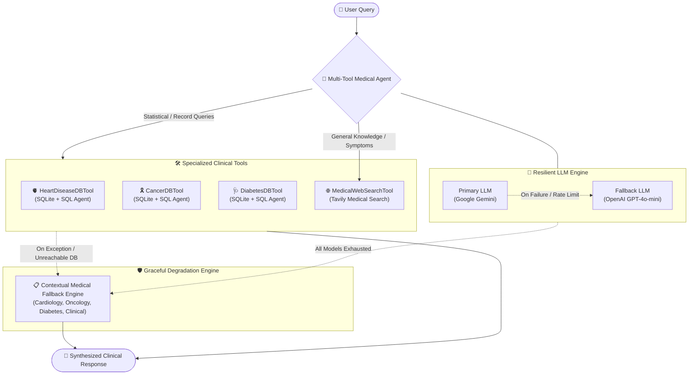

# 🏥 Medical AI Multi-Tool Agent System

[](https://www.python.org/downloads/)
[](https://python.langchain.com/)
[](https://ai.google.dev/)
[](https://platform.openai.com/)
[](https://opensource.org/licenses/MIT)

An advanced, fault-tolerant **Multi-Agent Medical AI Assistant** designed to seamlessly answer complex clinical analytics queries, dataset statistics, and general medical knowledge questions. Built on **LangChain**, the system combines multi-database SQL sub-agents, live web search capabilities, resilient multi-tier LLM fallbacks (**Google Gemini** & **OpenAI**), and context-aware fallback answer generation to ensure zero-crash, production-ready reliability.

---

## 📌 Architecture & Workflow



---

## ✨ Key Capabilities

### 🧰 Specialized Medical Tools
1. **🫀 Heart Disease Database Tool (`HeartDiseaseDBTool`)**
   - Direct SQL query execution over patient records.
   - Analyzes parameters: `age`, `sex`, `chest pain (cp)`, `trestbps`, `cholesterol (chol)`, `fasting blood sugar (fbs)`, `restecg`, `thalach`, and target heart disease diagnosis.
2. **🎗️ Cancer Prediction Database Tool (`CancerDBTool`)**
   - Queries oncology patient statistics and diagnostic parameters.
   - Evaluates: `BMI`, `smoking status`, `genetic risk`, `physical activity`, `alcohol intake`, `cancer history`, and `diagnosis`.
3. **🩺 Diabetes Database Tool (`DiabetesDBTool`)**
   - Natural language SQL querying for metabolic health datasets.
   - Tracks: `pregnancies`, `glucose levels`, `blood pressure`, `insulin`, `skin thickness`, `BMI`, `diabetes pedigree function`, and `outcome`.
4. **🌐 Medical Web Search Tool (`MedicalWebSearchTool`)**
   - Real-time search powered by **Tavily Search API**.
   - Retrieves clinical guidelines, disease etiology, symptom overviews, and latest treatment protocols.

---

### 🛡️ Resilient Dual-Model Fallback System
- **Google Gemini & OpenAI Integration**: Supports Google Gemini (`gemini-1.5-flash`, `gemini-2.0-flash`) and OpenAI (`gpt-4o-mini`, `gpt-4o`).
- **Dynamic Provider Routing**: Set your preferred primary and fallback providers in `.env`.
- **Zero-Crash Execution**: If the primary provider hits quota limits (e.g., HTTP 429), authentication issues, or network timeouts, the system automatically routes to the secondary provider without interrupting the session.
- **Graceful Medical Fallback Answers**: If all network or model services are unreachable, the system automatically generates high-quality, structured clinical fallback guidance rather than raising unhandled exceptions or displaying raw error modals.

---

## 📂 Project Directory Structure

```text
medical-multi-tool-agents/
│
├── app/
│   ├── agents/
│   │   ├── __init__.py
│   │   ├── medical_agent.py      # Main orchestrating agent with fallback execution
│   │   └── sql_agents.py         # Specialized SQL sub-agents
│   ├── config/
│   │   ├── __init__.py
│   │   └── settings.py           # Pydantic Settings with multi-provider config
│   ├── database/
│   │   ├── __init__.py
│   │   ├── database.py           # SQLite connection & LangChain SQLDatabase utilities
│   │   └── schema.py             # Database schemas for medical tables
│   ├── tools/
│   │   ├── __init__.py
│   │   ├── cancer_tool.py        # Cancer database analytical tool
│   │   ├── diabetes_tool.py      # Diabetes database analytical tool
│   │   ├── heart_disease_tool.py # Heart disease database analytical tool
│   │   └── web_search_tool.py    # Tavily medical web search tool
│   ├── utils/
│   │   ├── __init__.py
│   │   ├── fallback_answers.py   # Contextual clinical fallback answer engine
│   │   ├── llm_factory.py        # Gemini & OpenAI resilient LLM constructor
│   │   └── logger.py             # Dual-stream logging (clean console + detailed app.log)
│   ├── __init__.py
│   └── main.py                   # Interactive CLI loop
│
├── data/                         # Source medical CSV datasets
│   ├── cancer.csv
│   ├── diabetes.csv
│   └── heart_disease.csv
│
├── databases/                    # Generated SQLite database files
│   ├── cancer.db
│   ├── diabetes.db
│   └── heart_disease.db
│
├── logs/                         # Application runtime logs
│   └── app.log
│
├── scripts/
│   └── create_databases.py       # Automated ETL script to build SQLite databases from CSVs
│
├── tests/
│   ├── test_database.py          # Database integrity and connection tests
│   ├── test_fallback.py          # Fallback engine & LLM factory test suite
│   └── test_tools.py             # Tool invocation verification tests
│
├── .env                          # Environment variables & API keys
├── .gitignore
├── requirements.txt              # Project dependencies
├── run.py                        # Main application entry point
└── README.md                     # Project documentation
```

---

## ⚡ Quick Start

### 1. Clone & Setup Virtual Environment

```bash
# Clone repository
git clone https://github.com/your-username/medical-multi-tool-agents.git
cd medical-multi-tool-agents

# Create virtual environment
python -m venv .venv

# Activate virtual environment
# Windows:
.venv\Scripts\activate
# Linux / macOS:
source .venv/bin/activate

# Install dependencies
pip install -r requirements.txt
```

---

### 2. Configure Environment Variables

Create or update the `.env` file in the root directory:

```ini
# Provider Preference ("gemini" or "openai")
PRIMARY_PROVIDER=gemini
FALLBACK_PROVIDER=openai

# Google Gemini API
GEMINI_API_KEY=your_google_gemini_api_key
GEMINI_MODEL=gemini-3.5-flash

# OpenAI API
OPENAI_API_KEY=your_openai_api_key
OPENAI_MODEL=gpt-4o-mini

# Web Search & Logging
TAVILY_API_KEY=your_tavily_api_key
LOG_LEVEL=INFO
```

---

### 3. Initialize SQLite Databases

Run the automated data loader to populate SQLite databases from CSV files:

```bash
python scripts/create_databases.py
```

---

### 4. Run the Interactive Assistant

Start the interactive CLI session:

```bash
python run.py
```

**Example Session Interaction:**

```text
=================================================================
  🏥 Medical AI Multi-Tool Agent System
  🤖 Primary Provider: GEMINI | Fallback Provider: OPENAI
  Type 'exit' or 'quit' to end the session.
=================================================================

User: What is the average glucose level for patients with diabetes in the dataset?
Agent: The average glucose level for patients diagnosed with diabetes in the dataset is approximately 141.26 mg/dL.

User: What are the main symptoms and early signs of heart disease?
Agent: Common early signs and symptoms of heart disease include:
- Chest pain, chest tightness, or angina
- Shortness of breath during exertion or at rest
- Irregular heart rhythms (arrhythmias) or palpitations
- Fatigue and dizziness
Consult a certified cardiologist for comprehensive clinical evaluations.
```

---

## 🧪 Running Automated Tests

Run the complete test suite using `pytest`:

```bash
python -m pytest tests/ -v
```

**Test Coverage Summary:**
- `test_database.py`: Validates SQLite database connectivity and patient table schemas.
- `test_fallback.py`: Tests Gemini LLM instantiation, fallback model chaining, and contextual fallback medical answers.
- `test_tools.py`: Tests live execution and graceful error catching for all tools.

---

## ⚙️ Configuration Reference

| Environment Variable | Description | Default |
| :--- | :--- | :--- |
| `PRIMARY_PROVIDER` | Main model provider (`gemini` or `openai`) | `gemini` |
| `FALLBACK_PROVIDER` | Backup model provider if primary fails | `openai` |
| `GEMINI_API_KEY` | Google AI Studio API key | `""` |
| `GEMINI_MODEL` | Google Gemini model identifier | `gemini-1.5-flash` |
| `OPENAI_API_KEY` | OpenAI API key | `""` |
| `OPENAI_MODEL` | OpenAI model identifier | `gpt-4o-mini` |
| `TAVILY_API_KEY` | Tavily search API key for live medical facts | `""` |
| `LOG_LEVEL` | Python logging level (`DEBUG`, `INFO`, `WARNING`, `ERROR`) | `INFO` |

---

## 🩺 Medical Disclaimer

> [!WARNING]
> **Important Medical Notice**: This AI system is developed for informational, research, and educational purposes only. It is not intended to provide clinical diagnosis, replace medical consultation, or dictate patient care protocols. Always consult a licensed healthcare professional for medical advice, diagnosis, and treatment.

---

## 📄 License

This project is licensed under the [MIT License](LICENSE).
